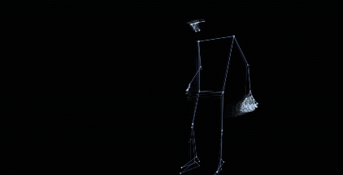
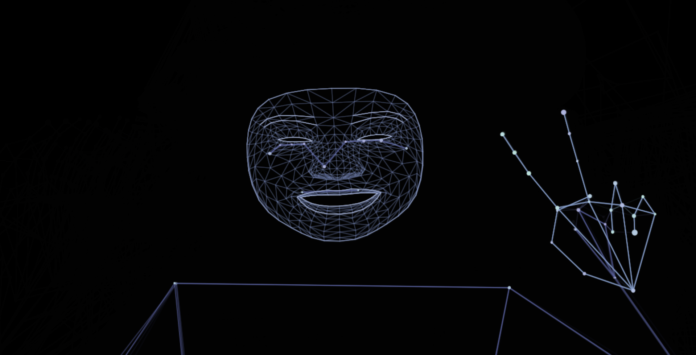

# motion_tracking

MediaPipeで体・手・顔をリアルタイム検出し、ランドマーク間を結んだネットワークとして可視化します。  
改善の余地しかないmotion_trackingです。

## デモ

**[Motion-Tracking links](https://hiro-est2004.github.io/motion_tracking/motion_tracking_ver1.html)**

## 使用技術

- [MediaPipe Tasks Vision API](https://ai.google.dev/edge/mediapipe/solutions/vision/overview) — PoseLandmarker / HandLandmarker / FaceLandmarker
- Canvas API
- Vanilla JavaScript

## 使い方

カメラへのアクセスを許可して、体・手・顔をカメラに向けると、ランドマーク間がリアルタイムで接続されます。